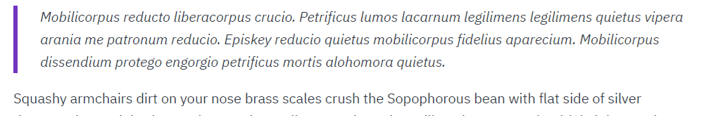

> 🗣 Easy **text-to-speech** for your [Gatsby](https://www.gatsbyjs.org/) site, powered by [Amazon Polly](https://aws.amazon.com/de/polly/).

# gatsby-mdx-tts

⚠️ This project is under heavy development, so breaking changes may occur on our road to a stable v1.0.0. Any bug reports and [contributions](#contribute-) will be highly appreciated.

[](#contribute-)
[](https://www.npmjs.com/package/gatsby-mdx-tts)
[](https://github.com/flogy/gatsby-mdx-tts/blob/master/LICENSE)

## Demo

> Check out the [▶️ LIVE DEMO](https://gatsby-mdx-tts.netlify.com/curses-counter-curses-and-more)!



Also check out the [example project repository](https://github.com/flogy/gatsby-mdx-tts-example)!

## Installation

`npm install --save gatsby-mdx-tts`

## How to use

### Prerequisites

1. In order to use this plugin you need an [AWS account](https://portal.aws.amazon.com/billing/signup). You can use the text-to-speech service ([AWS Polly](https://aws.amazon.com/de/polly/)) for free for the first 12 months (up to a couple million words to be precise).

   **Attention:** If you exceed the limits or use it after your initial free tier, using this plugin will generate costs in your AWS account!

2. As this is a plugin for [gatsby-plugin-mdx](https://github.com/gatsbyjs/gatsby/tree/master/packages/gatsby-plugin-mdx) it will only work if you have that plugin installed and configured properly as well.

### Mandatory configurations

#### gatsby-config.js

To include the plugin just add it to your `gatsby-plugin-mdx` configuration in the `gatsbyRemarkPlugin` section. In case you have multiple `gatsbyRemarkPlugins` configured is very important that you put the `gatsby-mdx-tts` plugin to **first position**!

Also, you need to include a couple of mandatory configurations:

```javascript
// In your gatsby-config.js
plugins: [
  {
    resolve: `gatsby-plugin-mdx`,
    options: {
      gatsbyRemarkPlugins: [
        {
          resolve: "gatsby-mdx-tts",
          options: {
            awsRegion: "us-east-1",
            defaultVoiceId: "Justin",
          },
        },
      ],
    },
  },
],
```

#### AWS credentials

The plugin requires your AWS credentials in order to generate the text-to-speech files.

There are two ways to configure your AWS credentials:

1. _(recommended)_ The recommended way is to [create a shared credentials file](https://docs.aws.amazon.com/ses/latest/DeveloperGuide/create-shared-credentials-file.html). You probably already have one if you used the AWS CLI before.
2. To override the credentials defined in a shared credentials file or to easily build on a CI environment you can optionally pass in the AWS credentials using plugin configuration options:

```javascript
// In your gatsby-config.js
{
  "resolve": "gatsby-mdx-tts",
  "options": {
    "awsCredentials": {
      "accessKeyId": process.env.GATSBY_AWS_ACCESS_KEY_ID,
      "secretAccessKey": process.env.GATSBY_AWS_SECRET_ACCESS_KEY,
    },
  },
},
```

**Attention:** If you choose to go with option 2 it is highly recommended to work with [environment variables](https://www.gatsbyjs.org/docs/environment-variables/) (as seen in the example above)! Do not directly paste your AWS credentials into your `gatsby-config.js` file and commit it to git as this would be a security issue!

### All configurations

| Option                      | Required | Example                                                                                                                |
| --------------------------- | -------- | ---------------------------------------------------------------------------------------------------------------------- |
| `awsRegion`                 | Yes      | `"us-east-1"`                                                                                                          |
| `defaultVoiceId`            | Yes      | `"Justin"`                                                                                                             |
| `awsCredentials`            | No       | `{ "accessKeyId": process.env.GATSBY_AWS_ACCESS_KEY_ID, "secretAccessKey": process.env.GATSBY_AWS_SECRET_ACCESS_KEY }` |
| `defaultSsmlTags`           | No       | `"<prosody rate='70%'>$SPEECH_OUTPUT_TEXT</prosody>"`                                                                  |
| `lexiconNames`              | No       | `["LexA", "LexB"]`                                                                                                     |
| `speechOutputComponentName` | No       | `"CustomComponent"`                                                                                                    |

##### About `defaultSsmlTags`:

- For an overview of all supported SSML tags check out the [supported SSML tags list](https://docs.aws.amazon.com/polly/latest/dg/supportedtags.html) in the AWS docs.
- The surrounding `<speak>` tag is added automatically.
- The variable `$SPEECH_OUTPUT_TEXT` will be replaced with the speech output text.

##### About `speechOutputComponentName`:

If you want to use your own component to handle the generated speech output you can specify its name using the `speechOutputComponentName` option. The plugin will then use this instead of `SpeechOutput` to extract the text to be used for TTS generation. Like that you can customize the way speech output is handled. Find more information about this in the [customization chapter](#customize).

### Embed speech output in your MDX

After configuring the plugin you can now add the `<SpeechOutput></SpeechOutput>` component to your MDX files. The surrounded content will then be playable. You can add multiple speech output blocks to your content, but make sure the `id` is always set to an **unique value over all occurrences**. Also, it is important that there is an empty line between the `SpeechOutput` tags and the content to get it working.

```markdown
import SpeechOutput from "gatsby-mdx-tts/SpeechOutput"

This text will be outside the speech output.

<SpeechOutput id="inside">

But this text will be playable. Please consider that:

- The play button is added automatically.
- The words in this text are marked one by one during text output.

</SpeechOutput>
```

## Customize

### Play button

To customize the play button you can use the optional `SpeechOutput` component prop `customPlayButton`. Just pass in your custom play button component.

If you choose to use a custom play button component, make sure it uses the `PlayButtonProps` exported from this plugin.

### Speech output handling

You can replace the whole speech output handling by using your own React component instead of the default `SpeechOutput` component. Like that, the TTS files are still generated during build phase but you can then do whatever you want with those files inside your component at runtime. To do so, use the `speechOutputComponentName` configuration option (see [About `speechOutputComponentName`](#about-speechoutputcomponentname)).

If you choose to use your own component, make sure it uses the `SpeechOutputProps` exported from this plugin.

## Event listeners

To be able to react to certain events you can register the following event listeners:

### `onWordMarked`

When a speech output is played the spoken words are highlighted in the text simultaneously. The `onWordMarked` listener is called as soon as a new word is highlighted and delivers the currently highlighted word as a string. When no word is highlighted (anymore) the string is empty.

## Contribute 🦸

Contributions are more than welcome! I would love to see text-to-speech becoming a thing in the already very accessible Gatsby ecosystem. If agree and would like to join me on this mission it would be awesome to get in touch! 😊

Please feel free to create, comment and of course solve some of the issues. To get started you can also go for the easier issues marked with the `good first issue` label if you like.

## License

The [MIT License](LICENSE)

## Credits

The _gatsby-mdx-tts_ library is maintained and sponsored by the Swiss web and mobile app development company [Florian Gyger Software](https://floriangyger.ch).
